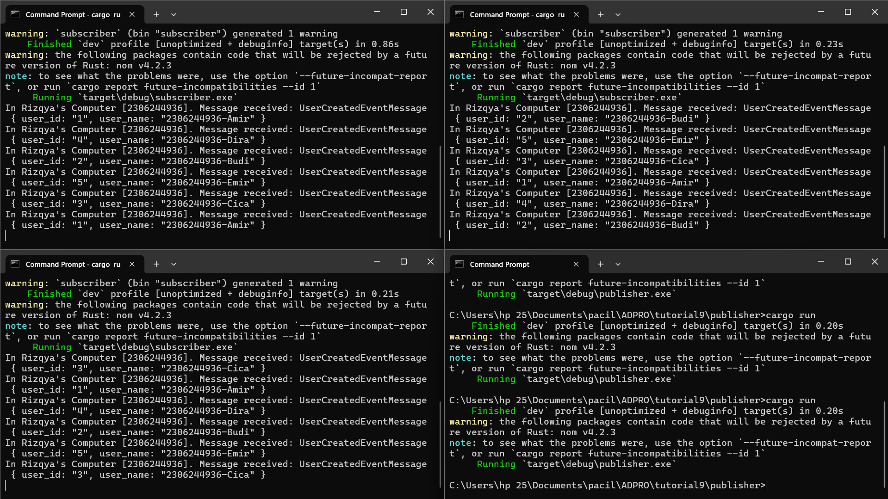
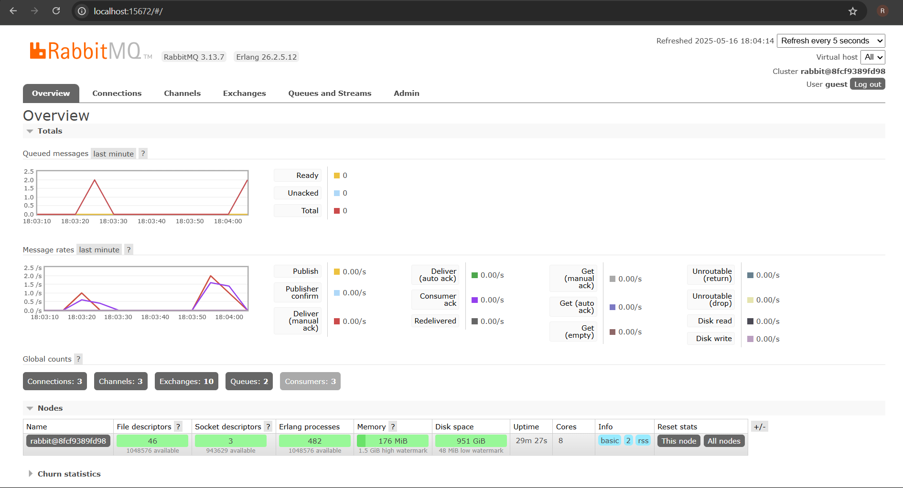

# Tutorial Module 9 Advanced Programming

Nama: Rizqya Az Zahra Putri

NPM: 2306244936

Kelas: B

## Reflection
a. What is amqp?

AMQP (Advanced Message Queuing Protocol) adalah protokol standar untuk pertukaran pesan antar sistem secara terdistribusi. Digunakan untuk komunikasi asynchronous antara aplikasi, terutama dalam arsitektur microservices.

b. What does it mean? guest:guest@localhost:5672 , what is the first guest, and what is the second guest, and what is localhost:5672 is for?

`guest:guest@localhost:5672` adalah connection string untuk koneksi ke server AMQP, misalnya RabbitMQ, menggunakan kredensial yang diberikan.
- `guest` pertama: Username yang digunakan untuk mengakses server AMQP
- `guest` kedua: Password pengguna
- `localhost:5672`: Alamat dan port di mana server AMQP berjalan. `localhost` berarti server tersebut berjalan di mesin yang sama dengan aplikasi yang mencoba terhubung dan `5672` adalah port default yang digunakan oleh server AMQP untuk menerima koneksi

## Simulating Slow Subscriber

Total queue meningkat karena publisher terus mengirimkan pesan lebih cepat daripada subscriber dapat memprosesnya. Setiap `cargo run` pada publisher menambah 5 pesan sekaligus ke queue, tetapi subscriber hanya menangani 1 pesan per detik, sehingga pesan-pesan tersebut menumpuk dalam antrean.

## 3 Subscriber's Console

Ketika menjalankan 3 console subscriber, terlihat bahwa pemrosesan pesan dibagi di ketiga subscriber tersebut. Pada console satu, memproses pesan untuk user_id 1 dan user_id 4, sementara console dua memproses pesan untuk user_id 2 dan user_id 5, dan console tiga memproses pesan untuk user_id 3. Hal ini menunjukkan bahwa RabbitMQ mendistribusikan pesan ke subscriber yang tersedia, sehingga meningkatkan efisiensi pemrosesan.

Dengan menambahkan lebih banyak subscriber, kita dapat mengurangi waktu pemrosesan total karena setiap subscriber dapat menangani pesan secara bersamaan. Ini terlihat di RabbitMQ, di mana spike jumlah antrean berkurang lebih cepat dibandingkan saat hanya ada satu subscriber yang lambat.

Dari sisi kode, menurut saya ada peningkatan yang mungkin dilakukan, yaitu pengaturan jumlah subscriber yang lebih dinamis berdasarkan beban kerja. Misalnya, menggunakan auto-scaling untuk menambah atau mengurangi jumlah subscriber sesuai dengan jumlah pesan yang masuk.